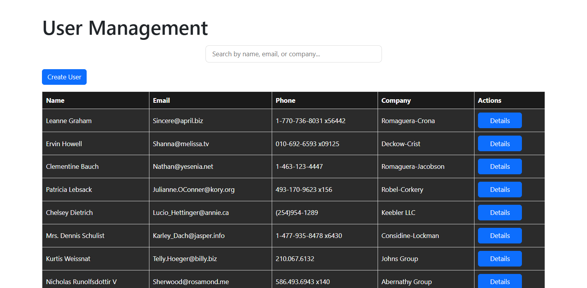

<p align="center">
  
</p>
<h2 align="center">User Management</h2>
<p align="center">
  <a href="https://user-mangment.vercel.app/">Demo</a>
</p>


<details>
  <summary >Table of Contents</summary>
  
  1. [Deployed Link & Working Demo](#deployed-link--working-demo)
  2. [About The Project](#about-the-project)
     - [Built With](#built-with)
  3. [Getting Started](#getting-started)
     - [Prerequisites](#prerequisites)
     - [Installation](#installation)
  4. [Usage](#usage)
  5. [Roadmap](#roadmap)
  6. [Contact](#contact)

</details>

### Deployed Link & Working Demo
<p align="center">
  <a href="https://user-mangment.vercel.app/">Click me</a>
</p>
<p align="center">
  
</p>


#### Built With

<table>
  <tr>
    <th colspan="3" align="center"><u>FrontEnd</u></th>
  </tr>
  <tr>
    <td><a href="https://react.dev/"></a></td>
    <td><a href="https://vitejs.dev/"></a></td>
   
  </tr>
  
  <tr>
   <td><a href="https://axios-http.com/"></a></td>
    <td><a href="https://react-icons.github.io/react-icons/"></a></td>
  </tr>
  <tr>
    <th colspan="3" align="center"><u>Version Control and Hosting</u></th>
  </tr>
  <tr>
    <td><a href="https://git-scm.com/"></a></td>
    <td><a href="https://vercel.com/"></a></td>
  </tr>
</table>


### Getting Started
To get a local copy up and running, follow these simple steps.

#### **Prerequisites**
Make sure you have the following installed:
- Node.js (v18 or above recommended)
- npm (comes with Node.js) or yarn

#### **Installation**
1. Clone the repo
```bash
  git clone https://github.com/sinhasandeep2006/user-Mangment.git
```
2. Move to project folder
```bash
   cd User-Mangment
```
4. Install frontend dependencies
```bash
  npm install
```

6. Running the Project
    <small>Start frontend dev server (in terminal)
 </small>
```bash
  npm run dev
```


## 📋 Usage

Here’s how you can use **User managment** after setting it up:
### 🎯 Home Options (Settings)
***<u>Details</u>***
- Name
- Company name
- Phone Number
- Email
- Details Button  

***<u>Details:</u>***
- **Username**: *User name*
- **Email**: *User email*
- **Phone**: *User Phone number*
- **Website**: *User Website*
- **Address**: *City name,Country*
- **Company**: *Company Name*
</small>

## Roadmap
Here’s the development plan and upcoming features for the Task Buddy:

 ## ✅ Requirements

### **Pages**
#### Home Page
- [x] Show a list of users in a table or card layout.
  -  Each user card should display:
      - [x] Name
      - [x] Email
      - [x] Phone
      - [x] Company name
- [x] Add a Search Bar to filter users by name or email.
Clicking on a user opens the User Details page.
---

#### User Details Page
- [x] Show detailed information about the selected user (from API).
Include a Back button to return to the Home page.

---

#### Add User Page
- [x] Create a simple form with fields:
   - [x]  Name
   -  [x] Email
   -  [x] Phone
   -  [x] Company

-  [x] Validate form inputs.
On submit, display the new user in the Home Page (you can store it locally — no need to call an API).s
---

## Contact
**Sandeep sinha**- **@avtadell** - **sandeep.sinha.dev@gmail.com**
